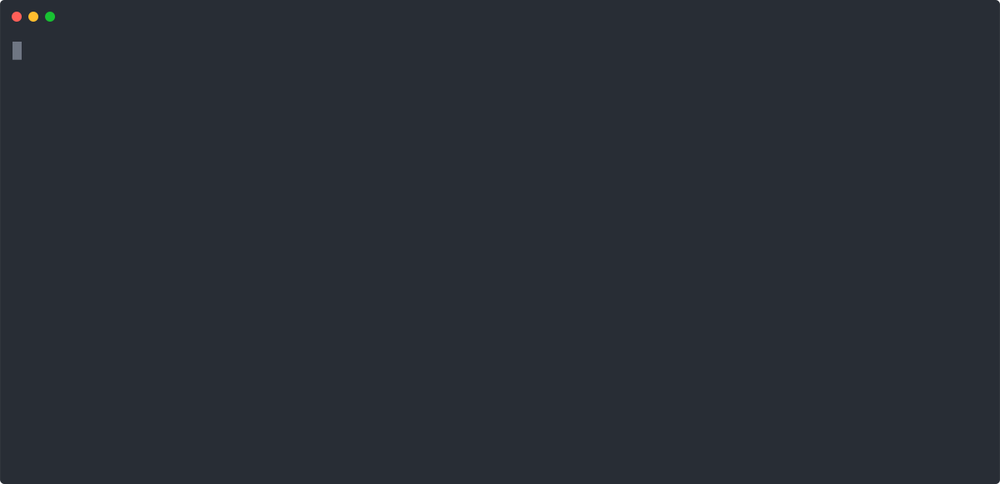

<div align="center">
<h1><a href="https://reacli.github.io/">Reacli</a> ⚡️💻</h1>

[](https://badge.fury.io/js/reacli)
[](https://travis-ci.com/reacli/cli)

This is a React CLI that helps with boilerplate.
</div>


----

## See the landing website [here](https://reacli.github.io/)

> We describe briefly the features of the **Reacli** tool here.
> For more details on how the tool works and how to use the different options, please refer to the landing website [`https://reacli.github.io/`](https://reacli.github.io/)

----

<p align="center">

  
  
</p>


----

```
$ npx reacli -h

  ____                 _ _ 
 |  _ \ ___  __ _  ___| (_)
 | |_) / _ \/ _` |/ __| | |
 |  _ <  __/ (_| | (__| | |
 |_| \_\___|\__,_|\___|_|_|
                           
Usage: reacli [argument] [path(s)] [options]

Argument:
  component                 To create a new component
  hook                      To create a React Hook

Options:
  -V, --version             Output the version number
  -f, --flow                Add flow to the template
  --scss                    Use SCSS instead of classic css
  --redux                   Add Redux to the template
  -i, --ignore-config-file  Ignore the '.reacli' optional configuration file
  --extension [value]       The file extension to use for the templates ('js' or 'jsx')
  -h, --help                Output usage information
```

----

## Table of contents

  - [Installation](#installation)
    - [Using `npm`](#using-npm)
    - [Using `yarn`](#using-yarn)
  - [Usage](#usage)
    - [How to use `Reacli`?](#how-to-use-reacli)
    - [Interactive CLI](#interactive-cli)
    - [CLI features](#cli-features)
      - [Component creation](#component-creation)
      - [Hook creation](#hook-creation)
      - [Global configuration](#global-configuration)

----

## [Installation](https://reacli.github.io/installation/)

You can use **Reacli** either as a global package, or download it and use it whenever it's needed.

We describe here how to install it globally in different ways, depending on your package manager.

### Using `npm`

```bash
npm install -g reacli
```

### Using `yarn`

```bash
yarn global add reacli
```

## [Usage](https://reacli.github.io/usage/)

### How to use `Reacli`?

#### Case 1: **Reacli** is installed globally

You can directly run the `reacli` command from a terminal such as:

```bash
reacli component path/to/my/component
```

#### Case 2: you want to download it when it is needed with `npx`

```bash
npx reacli component path/to/my/component
```

### Interactive CLI

To facilitate the use of **Reacli**, we decided to create an interactive CLI, asking you some questions guiding you to create what you want.

To use it, just run:

```bash
reacli
```

<p align="center">

  
  
</p>


### CLI features

You can also use **Reacli** to directly configure what you want and save some time.

Today, **Reacli** enables to create:

- Components
- Hooks

#### Component creation

**Reacli**'s main feature is to create easily new components. To create a new component with the default configuration:

```bash
reacli component ./my-super-component
```

It will generate a structure like:

```text
.
└── my-super-component
    ├── components
    |   ├── MySuperComponent.jsx
    |   ├── MySuperComponent.css
    |   └── MySuperComponentContainer.jsx
    └── index.js
```

For more details about why we chose this configuration as a default one, please see [here](https://reacli.github.io/usage/architecture/).

##### [Options](https://reacli.github.io/options/)

**Reacli** enables to customize your components creation thanks to several options. You can combine several options.

- `-f` or `--flow` option adds Flow to your generated component
- `--scss` to use a SCSS style file instead of the default CSS one
- `--redux` option adds a React-Redux default configuration to your generated component
- `-i` or `--ignore-config-file` to ignore the `.reacli` configuration file if one is found and use default options or the ones given at runtime to the CLI
- `--extension [value]` where `value` is either "*js*" or "*jsx*" to configure the file extension of the generated component files

##### Create several components at once

To create several components in one single command, just type several paths such as:

```bash
reacli component ./my-super-component1 ./my-super-component2
```

#### Hook creation

**Reacli** also enables to create React hooks. The functioning is quite similar to components creation. To create a hook with the default configuration:

```bash
reacli hook ./my-super-hook
```

It will generate a structure like:

```text
.
└── my-super-hook
    ├── hooks
    |   ├── MySuperHook.jsx
    |   └── MySuperHook.css
    └── index.js
```

##### Options

You can configure some options to customize the way **Reacli** creates your hook:

- `--scss` to use a SCSS style file instead of the default CSS one
- `--extension [value]` where `value` is either "*js*" or "*jsx*" to configure the file extension of the generated hook files
- `-i` or `--ignore-config-file` to ignore the `.reacli` configuration file if one is found and use default options or the ones given at runtime to the CLI

##### Create several hooks at once

To create several hooks in one single command, just type several paths such as:

```bash
reacli hook ./my-super-hook1 ./my-super-hook2
```

#### Global configuration

You might want to use several times **Reacli** in your project to create many new components. It might be annoying having to type the different options you want to use each time you use **Reacli**.

That is why we enable the creation of a configuration file.

##### Usage
To use a global configuration, at the root of your project (next to the `package.json`), you can create a `.reacli` file. Its content, formatted as JSON, might contain the following key-value pairs:

```js
// .reacli
{
  "scss": true, // or false
  "flow": true, // or false
  "redux": true, // or false
  "extension": "js" // or jsx 
}
```

If one option is not set in your `.reacli` file, the default one will be used. 

> Not having a `.reacli` file is like having one that contains:
>```js
>// .reacli
>{
>  "scss": false,
>  "flow": false,
>  "redux": false,
>  "extension": "jsx" 
>}
>```


##### Ignore the global configuration

When using a `.reacli` file to configure the **Reacli** tool globally for your project, it might happen that you want to ignore this configuration file when creating a new element.

To do so, you can use the `-i` or `--ignore-config-file` argument.
